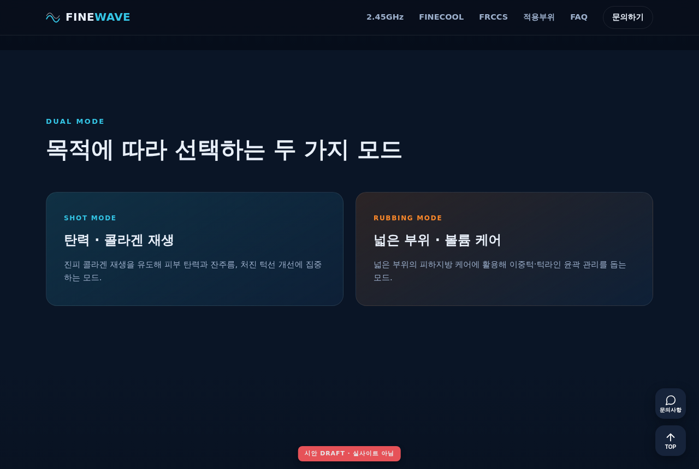
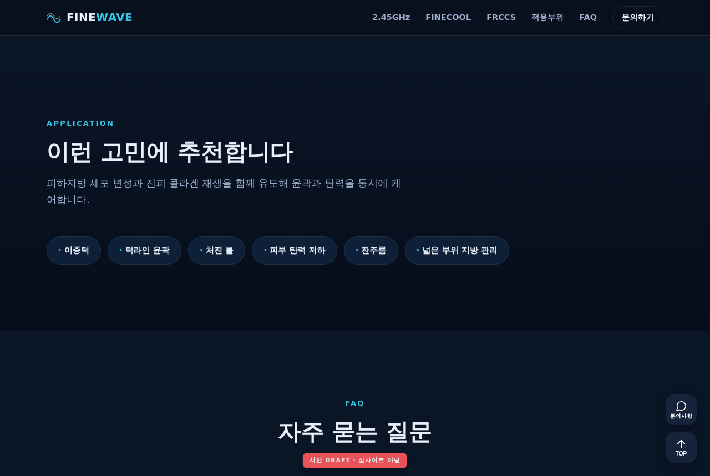

# FINEWAVE 홈페이지 리뉴얼 — 시안 미리보기 (DRAFT)

> 이 페이지는 **GitHub에서 바로 렌더되는 시안 미리보기**입니다(아래 스크린샷).
> 실제로 **움직이는 화면**(빔 깜빡임·배경 웨이브 드리프트·스크롤 등장·호버·아코디언·플로팅 TOP)은
> `index.html`을 브라우저에서 열어 확인하세요 — 아래 "실물로 보는 법" 참고.
>
> 사이트 무접촉 제작 · 색/카피/사진은 컨펌 후 실측·실사진으로 교체 · 우측 하단 붉은 배지로 실사이트와 구분.

---

## 반영된 요청사항 (임의 판단 통합)

| 요청 | 시안 반영 |
|---|---|
| 투명 헤더(메뉴-메인 일체감, inmode 톤) | 최상단 투명 → 스크롤 시 블러 솔리드로 전환 |
| 장비 고정 + 배경만 이동(xerf 톤) | 히어로 장비 고정, 배경 웨이브 26s 느린 드리프트 |
| 빔 깜빡임(승인됨) | 핸드피스 팁에서 오렌지 빔 2.8s 크로스페이드 맥동 |
| 웨이브 패턴(2.45GHz 깨짐 교체) | 히어로/기술 섹션에 라인 웨이브(시안 글로우) 적용 |
| 우측 플로팅 = 문의 + TOP 2개 | 문의사항(항상) + TOP(300px 후 페이드인) |
| 전 페이지 폰트 통일 | Pretendard/Noto Sans KR 단일 스택 |
| 모션 전반(sherean 감도) | 스크롤 등장 페이드, 호버 리프트, 냉각 링 펄스 |
| FRCCS NO CONTACT 카드 | 해당 카드만 어둡게(밝기 60%) |
| 접근성 | 전 모션 `prefers-reduced-motion` 정지 대응 |

---

## 데스크톱 (1280px)

### 1) 히어로 — 투명 헤더 · 배경 웨이브 · 장비+빔


### 2) 2.45GHz 기술 — 웨이브 배경 흐름 + 스탯


### 3) FINECOOL 냉각 — 이중 냉각 비주얼(펄스 링)


### 4) FRCCS — 가운데 **NO CONTACT** 카드만 어둡게(T7)


### 5) 듀얼 모드 — Shot / Rubbing


### 6) 적용 부위 칩


### 7) FAQ — CSS 아코디언


### 8) 문의 CTA


---

## 모바일 (390px)

| 히어로 | FRCCS |
|---|---|
|  |  |

햄버거 메뉴, 세로 스택, 플로팅 버튼 축소 적용.

---

## 실물(움직이는 화면)로 보는 법

정적 스크린샷이라 모션은 안 보입니다. 인터랙션까지 확인하려면:

1. **로컬에서 열기(가장 간단)**
   ```
   git fetch origin claude/finewave-homepage-redesign-33wdsi
   git checkout claude/finewave-homepage-redesign-33wdsi
   ```
   → `output/mockup/index.html` 을 크롬에서 더블클릭.
   파일 하나로 완결(외부 의존 0)이라 그냥 열면 전부 동작합니다.

2. 이 레포는 비공개라 GitHub가 HTML을 화면으로 렌더하지 않습니다(소스만 보임).
   공개 미리보기 링크가 필요하면 말씀해 주세요 — 방법 안내드리겠습니다.

---

## 다음 단계 (컨펌 후 수정)

아래 중 원하시는 방향을 알려주시면 바로 반영합니다:

- **컬러**: 현재 다크 네이비 + 시안 + 오렌지빔. 톤 조정(더 밝게/차분하게 등)
- **웨이브**: 3종(파인라인 / 성근곡률 / 시안글로우) 중 선호 → `../wave-patterns/`
- **빔 주기/세기**: 현재 2.8s 깜빡. 더 은은한 맥동(--soft)도 가능
- **NO CONTACT 강도**: 70% / 60%(현재) / 50%
- **카피·섹션 구성·순서**: 문구는 예시라 실제 카피로 교체 필요(의료 표현은 인허가 문구 검수)
- **폰트**: 실제 사이트 기준 폰트로 통일
