# FINEWAVE 홈페이지 리뉴얼 — 시안 v3 미리보기 (DRAFT)

> **v3 변경점 (디자인 고급화)**
> 1. **폰트 교체**: Pretendard Variable을 파일로 내장(외부 CDN 의존 0) — 제목 자간 -0.035em·굵기 정제, 태그라인 "GO FINE. GET DEFINED." 와이드 레터스페이싱, 본문 가독 굵기/행간 조정
> 2. **플로팅 버튼 리디자인**: 모난 사각 → **글래스 서클**(블러+그라디언트 헤어라인 보더+시안 글로우 호버)
> 3. **3D 장비 연출**: 히어로 장비에 퍼스펙티브 마우스 틸트(±9°) + 상하 플로팅(6.5s) + 바닥 리플렉션 + 시안 앰비언트 글로우
>
> **v2**: 실사이트 캡처 기반 실제 장비 사진·실카피·실메뉴(INTRO/2.45GHz/FINECOOL™/FRCCS/FAQ)·실버튼 톤, 빔 실이미지 off/on.
>
> 움직이는 화면(빔 깜빡임·배경 드리프트·3D 틸트·서서히 등장·TOP 페이드인)은 `index.html`을 브라우저에서 열어 확인 — 하단 "실물로 보는 법".
>
> 💡 **360° 회전 관련**: 진짜 제품 360 스핀은 장비를 15° 간격(24~36컷)으로 회전 촬영한 사진 세트가 필요합니다. 컷이 확보되면 외부 라이브러리 없이 순수 JS 드래그-회전 시퀀스로 구현 가능합니다(사이트 규칙 준수). 현재 시안은 보유 사진 2컷 한계 내에서 **3D 틸트+플로팅+리플렉션**으로 입체감을 구현했습니다.

---

## 클라이언트 요청 ↔ 시안 반영표

| PPTX 요청 | 반영 |
|---|---|
| 이미지·텍스트 서서히 나타나게 | 전 섹션 스크롤 등장 페이드(0.8s, 순차) |
| 장비는 고정, 배경만 움직이게 (xerf) | 히어로 장비 고정 + 배경 웨이브만 28s 드리프트 |
| 메뉴바-메인이미지 일체감 (inmode) | 투명 헤더 → 스크롤 시 솔리드 전환 |
| 장비사진 더 키워주세요 | 2.45GHz 섹션 장비 사진 대형 배치 |
| 폰트 작고 가독성↓ → 수정 | 본문 16px+, 제목 30~46px로 확대 |
| 배경 웨이브 깨짐 → 유사 패턴 교체 | 신규 벡터 웨이브(SVG, 무한 확대 무깨짐) 적용 |
| 빔 깜빡깜빡 (원본 없음→보정 제작) | **실사이트 핸드피스 캡처 보정**으로 off/on 프레임 제작, 2.8s 맥동 |
| 이미지-텍스트 대칭 정렬 | FINECOOL 좌우 5:5 그리드 정렬 |
| 폰트 전 페이지 통일 | 단일 폰트 스택 전 섹션 적용 |
| NO CONTACT 부분 어둡게 | NO CONTACT 카드만 밝기 60% |
| FRCCS 클릭 시 반만 나옴 (1920×1080) | 헤더 오프셋 `scroll-margin-top` 적용(시안 내 동작) |
| 우측 버튼 → 문의사항 + TOP | 현행 버튼 톤(다크+연보더+흰 아이콘) 그대로 문의+TOP 세트 |

---

## 데스크톱 (1280px)

### 1) INTRO 히어로 — Pretendard 타이포 + 실장비 + 리플렉션
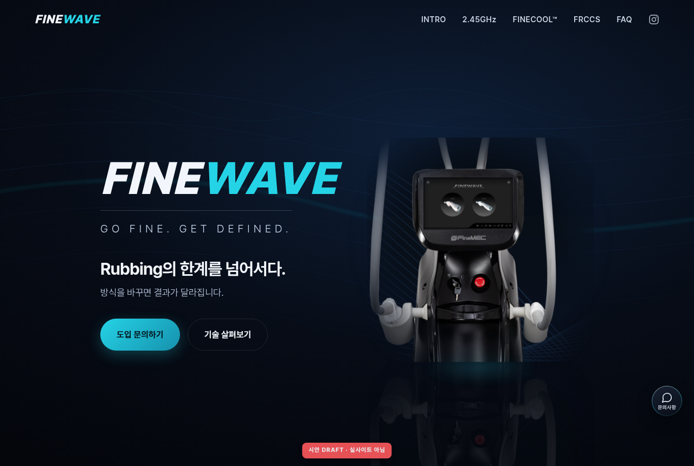

### 1-b) 3D 마우스 틸트 (커서 따라 장비가 입체 회전)
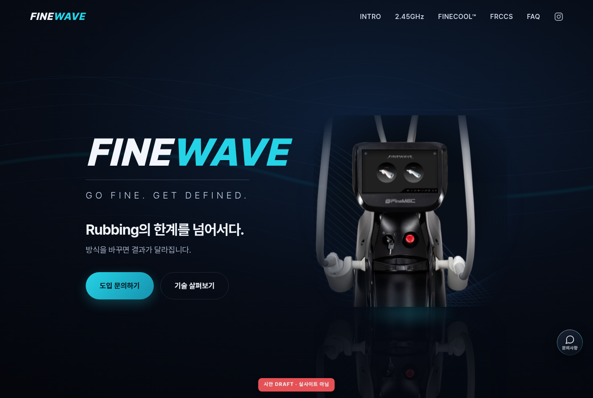

### 2) 2.45GHz — 실카피 + 장비 확대 + 새 웨이브 배경
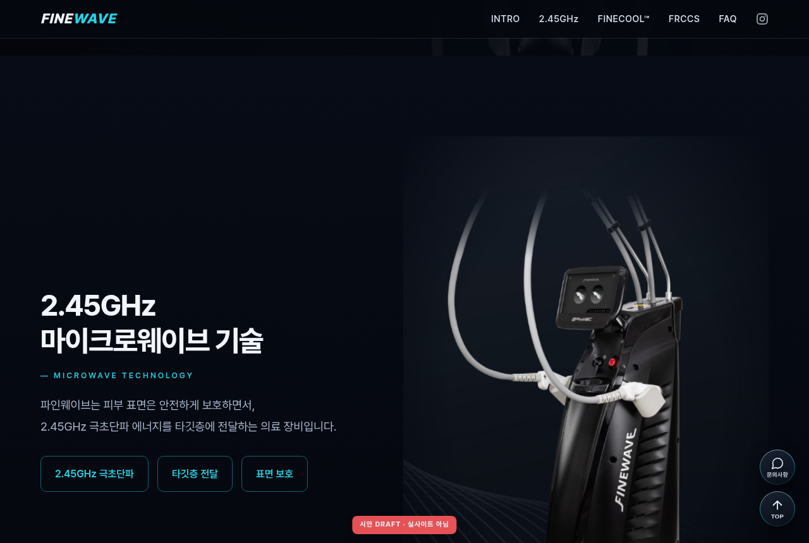

### 3) FINECOOL™ — **실사이트 빔 이미지** 깜빡임(정지컷은 off 프레임)
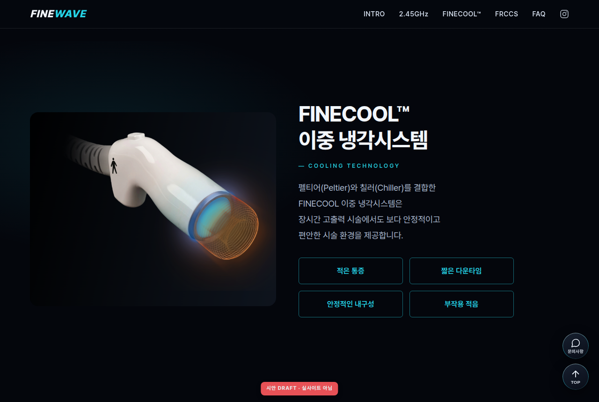

### 4) FRCCS — 실카드, **NO CONTACT만 어둡게**
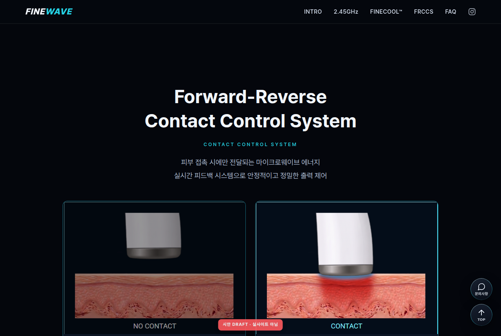

### 5) FAQ
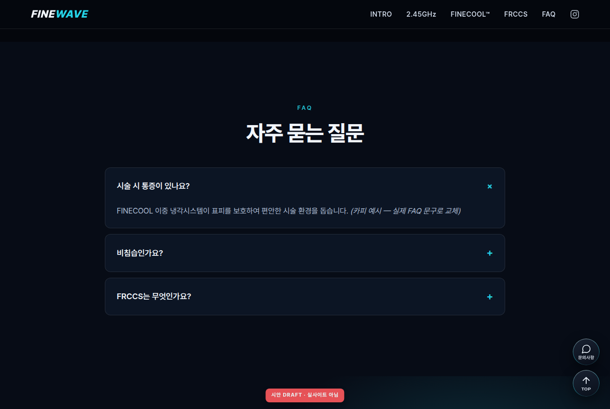

### 6) 문의 CTA
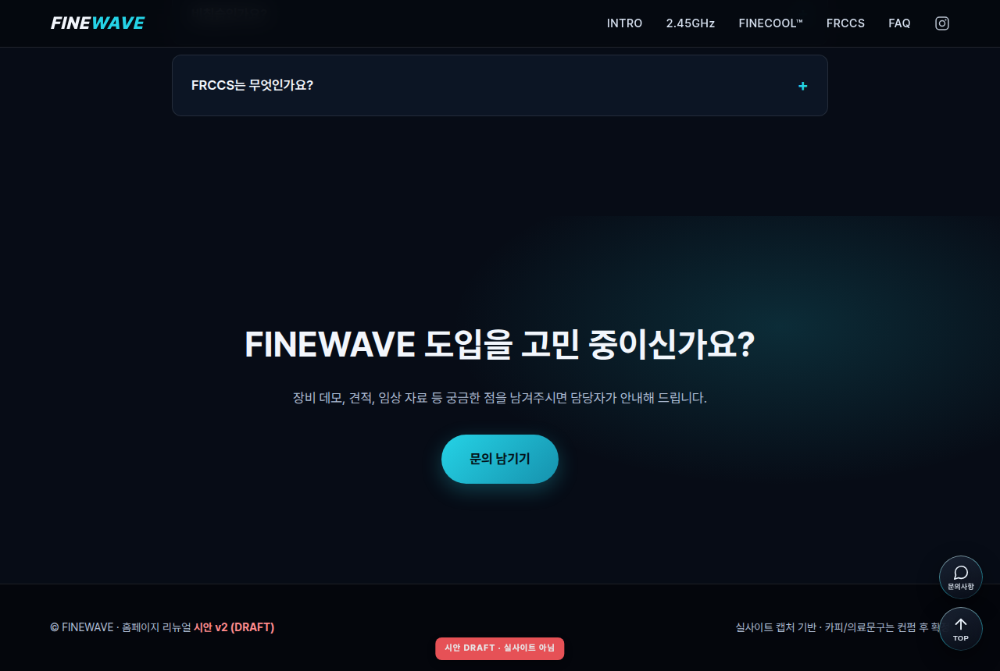

---

## 모바일 (390px)

| 히어로 | FRCCS |
|---|---|
| 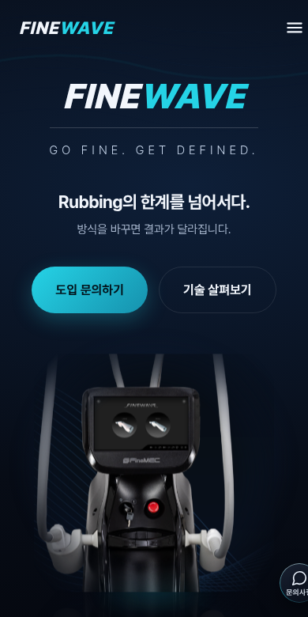 | 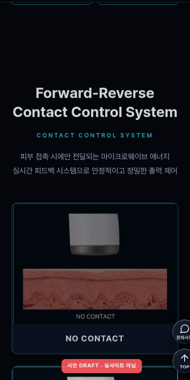 |

---

## 빔 깜빡임 프레임 (실이미지 기반)

| OFF (감쇠) | ON (발광 강화) |
|---|---|
| 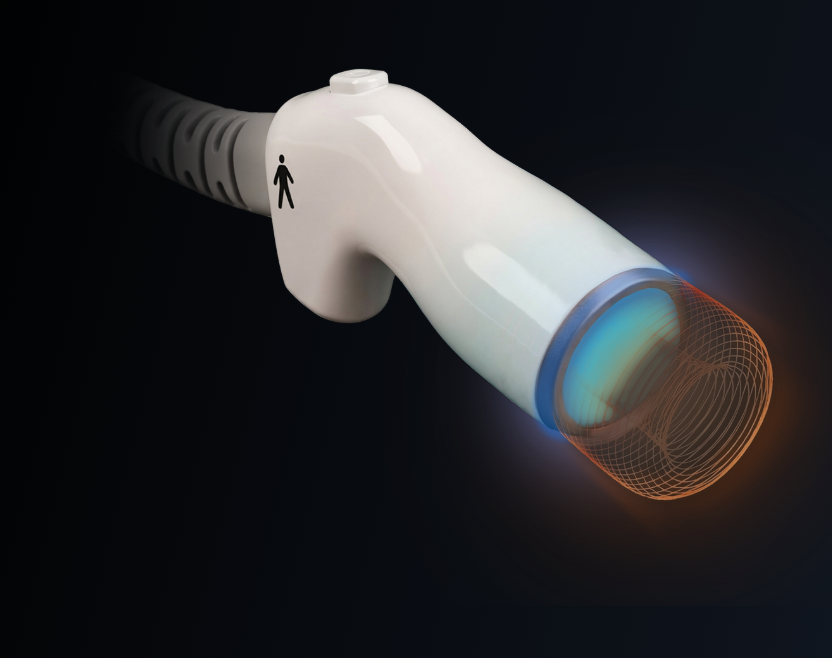 | 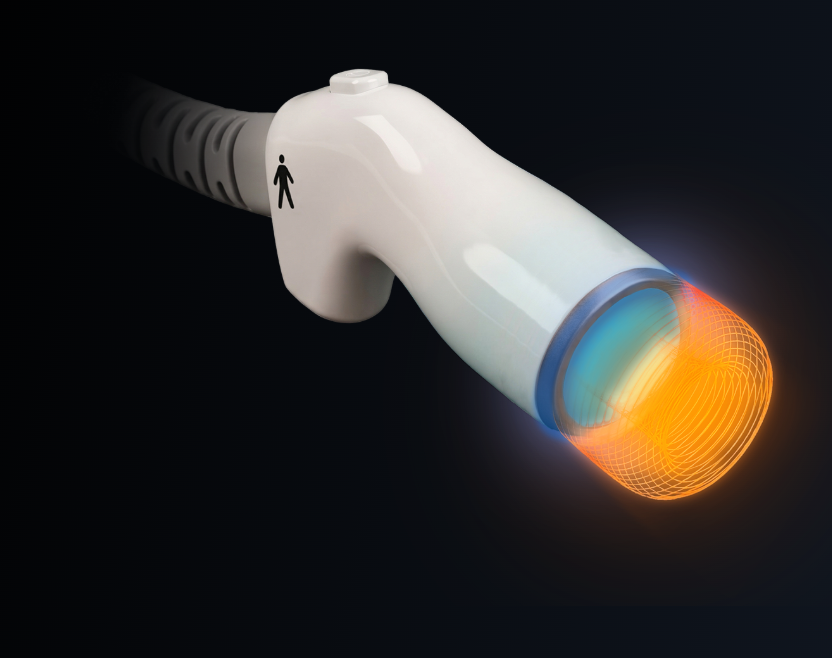 |

두 프레임을 겹쳐 opacity 크로스페이드 → 실제 동작은 `index.html` 또는 `../beam-blink/preview.html`.

---

## 실물(움직이는 화면)로 보는 법

```
git fetch origin claude/finewave-homepage-redesign-33wdsi
git checkout claude/finewave-homepage-redesign-33wdsi
```
→ `output/mockup/index.html` 크롬에서 열기 (외부 의존 0, 그냥 열면 동작).

---

## 남은 확인 사항

- **정확한 폰트명/색상값**: 캡처로는 폰트 파일명을 특정할 수 없어 근사 스택(Noto Sans KR) 사용 — F12 실측값 오면 1:1 교체
- **장비 누끼/PSD**: 드라이브 공유폴더에서 장비사진 폴더가 이 계정에 공유 안 됨(임상사진만 접근 가능) → **`cccompanymaster@gmail.com`에 장비사진 폴더 공유** 부탁드립니다. 누끼 확보 시 히어로 배경 모션을 케이스 A(진짜 레이어 분리)로 업그레이드
- 카피·의료 문구 최종본, 웨이브 3종 중 선호, NO CONTACT 강도(70/60/50), 빔 주기 컨펌
