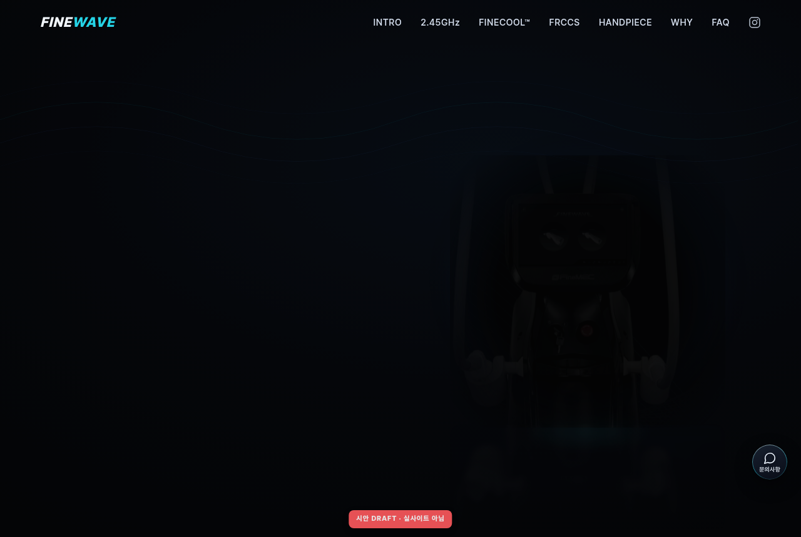
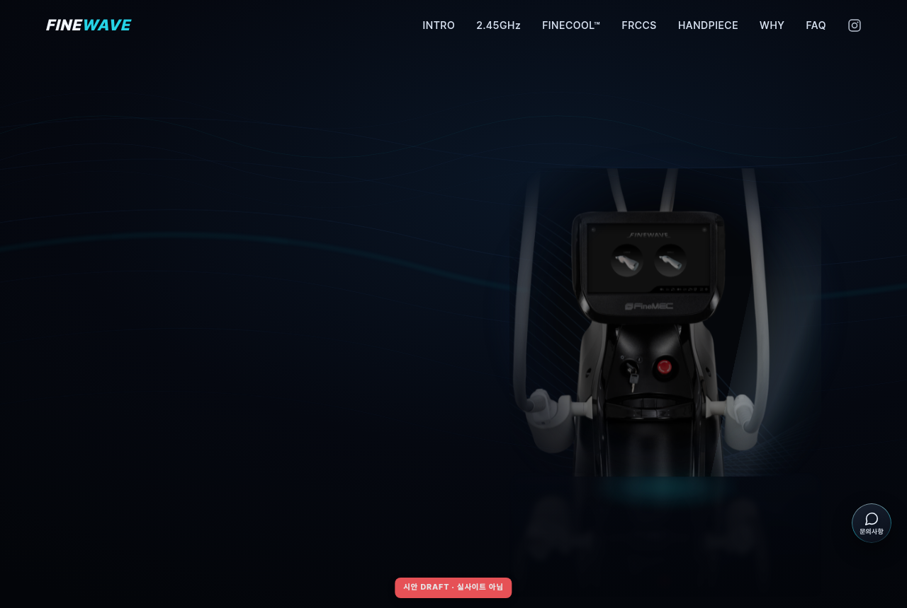
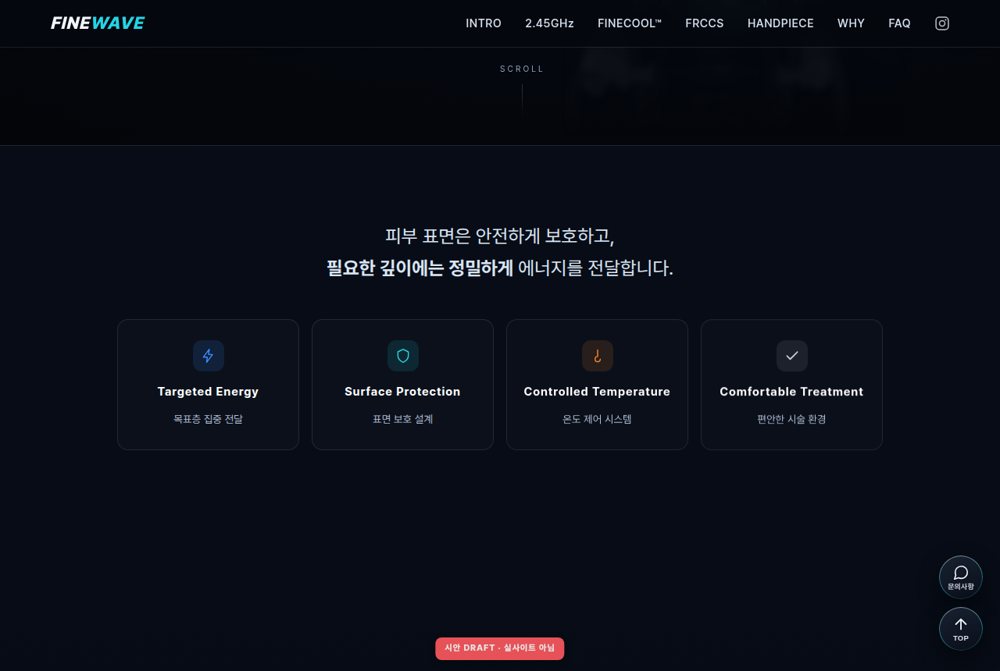
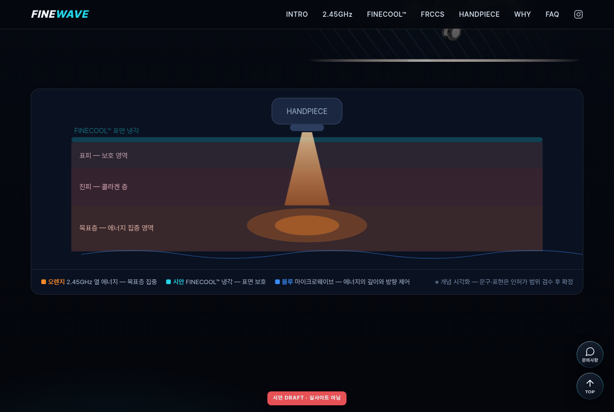
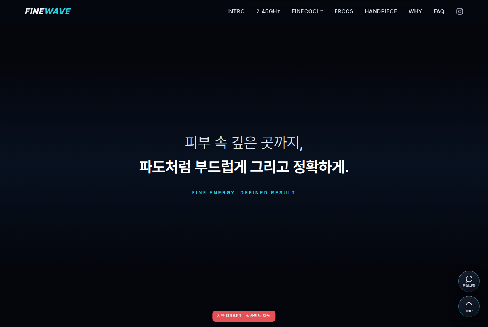
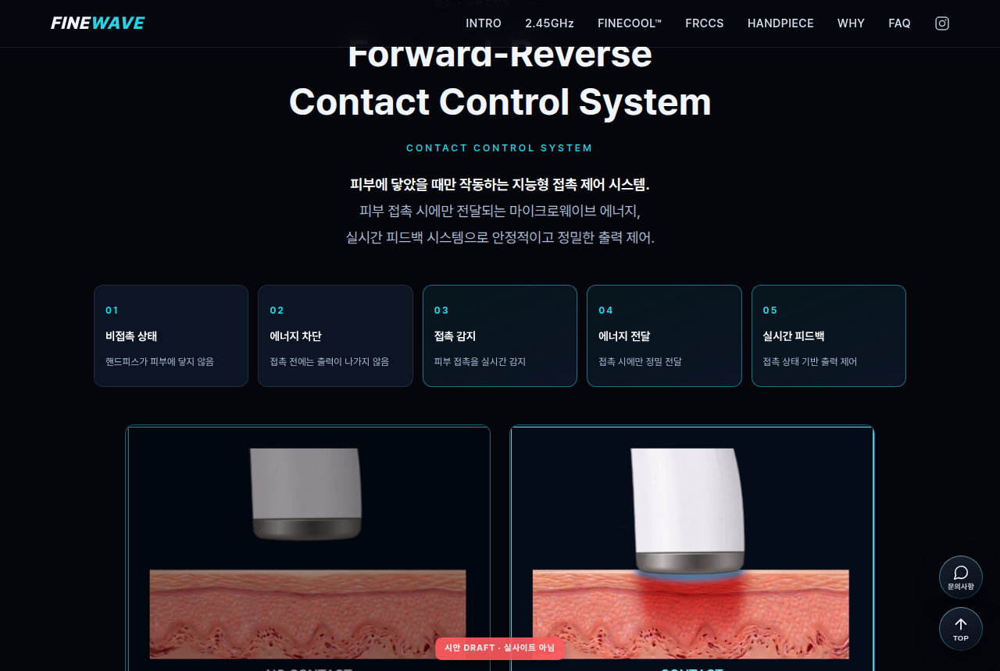
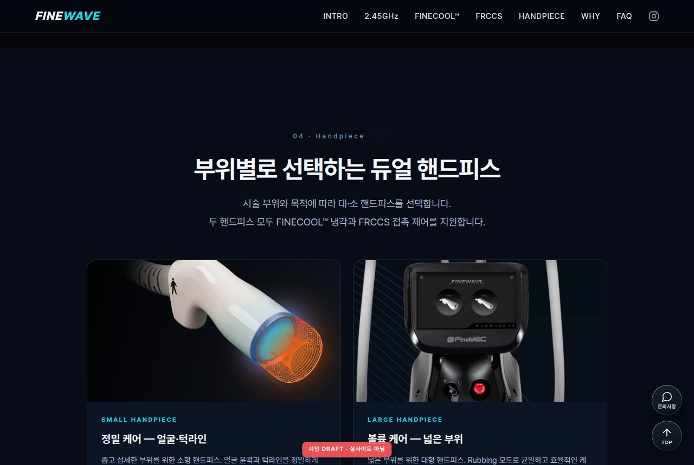
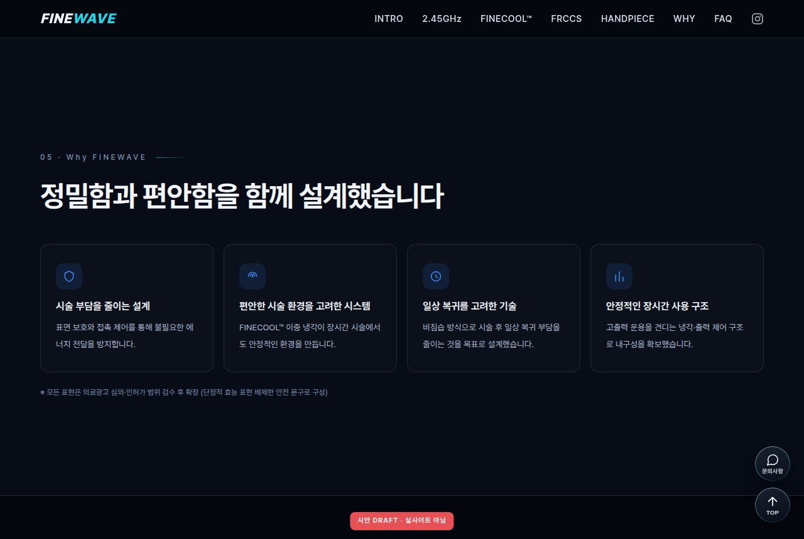
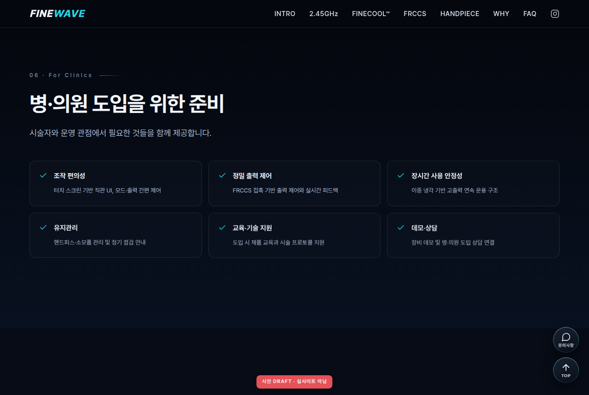

# FINEWAVE 홈페이지 리뉴얼 — 시안 v6 미리보기 (DRAFT)

> **v6 변경점 (스토리텔링 확장 — 기존 정체성 유지 지침 반영)**
> "제품을 보여준다 → 기술을 이해시킨다 → 안전성을 증명한다 → 시술 경험을 상상하게 한다 → 문의로 연결한다" 흐름으로 확장:
>
> | 항목 | 내용 |
> |---|---|
> | 컬러 시스템 | **Blue Energy(#3b8dff) + Orange Heat(#ff8a2b) + Cyan Cooling(#25d3e6)** — 네이비·블랙 유지, 쉬리안 퍼플 미채택 |
> | 히어로 카피 | "2.45GHz, 정밀함을 정의하다." + "Power Beneath. Comfort Above." (후보 카피, 컨펌 대상) · 에너지 펄스 오렌지(열)+시안(냉각) 이원화 |
> | 핵심 가치 (신설) | Targeted Energy · Surface Protection · Controlled Temperature · Comfortable Treatment 4키워드 스트립 |
> | 2.45GHz | **피부 단면 다이어그램** 신설 — 표피/진피/목표층 + 오렌지 에너지 도달 + 시안 표면 냉각 시각화 |
> | FINECOOL™ | "Heat where it matters. Cool where it matters." 카피 적용 |
> | FRCCS | **5단계 프로세스**(비접촉→차단→감지→전달→피드백) + "지능형 접촉 제어 시스템" 리드 카피 |
> | HANDPIECE (신설) | 대·소 핸드피스 카드 2종 (부위·모드·기능 태그) |
> | WHY FINEWAVE (신설) | 심의 안전 표현 4카드 ("부작용 적음" 등 단정 표현 배제) |
> | FOR CLINICS (신설) | 병·의원 도입 관점 6항목 (조작성·출력제어·유지관리·교육지원 등) |
> | PRODUCT INQUIRY | 문의 폼 확장 — 병원명/담당자/연락처/이메일/상담유형/내용 |
> | 메뉴 | INTRO · 2.45GHz · FINECOOL™ · FRCCS · **HANDPIECE · WHY** · FAQ · 문의하기 |

> **v5 변경점 (레퍼런스 오프닝 영상 학습 반영 — 시네마틱 히어로 리빌)**
> "어두운 공간에서 제품이 천천히 드러나고, 에너지가 정밀하게 흐르는" 오프닝을 CSS/JS로 재현:
> 1. **0~1.3s 암전 베일** → 서서히 걷힘 (시네마 블랙 `#050505` 배경으로 심화)
> 2. **장비 실루엣 리빌**: 어둠 속 실루엣 → 3.2s에 걸쳐 서서히 드러남
> 3. **1.5s 라이트 스윕**: 사선 하이라이트가 장비 표면을 훑고 지나감
> 4. **에너지 펄스**: 얇은 시안 빛 입자 3개가 장비 주변 곡선 경로를 따라 흐름 (정밀·안정 무드, 과격함 배제)
> 5. **2.3s~ 텍스트 순차 등장**: 로고 → 태그라인 → 카피 → CTA → SCROLL
> 6. **`video-brief.md` 신설**: 실사 시네마틱 영상(8~10s) 제작용 FINEWAVE 번안 프롬프트
>    (쉬리안 원본의 백색 장비·퍼플을 블랙 타워·시안으로 치환, 히어로 `<video>` 슬롯 준비)
> 컬러는 FINEWAVE 브랜드(시안)를 유지 — 레퍼런스의 퍼플/마젠타는 쉬리안 브랜드색이므로 미채택(원하면 변수 전환 가능).

### 시네마틱 리빌 시퀀스
| ① 암전·실루엣 (0.9s) | ② 라이트 스윕 (2.1s) | ③ 완성 프레임 (5s) |
|---|---|---|
|  |  |  |

> **v4 변경점 (sherean.co.kr 레퍼런스 톤 보완)**
> 클라이언트 레퍼런스(sherean)의 모션 감도·여백 문법 기준으로 보완:
> 1. **등장 모션 감도**: 1.15s로 느리고 부드럽게 + 형제 요소 자동 시차(0.12s 계단) + 이미지 스케일-인(1.045→1)
> 2. **히어로 로드 시퀀스**: 로고 → 태그라인 → 장비 → 카피 → CTA 순차 등장(스크롤 전 최초 로드)
> 3. **브레딩 룸**: 섹션 상하 여백 최대 165px로 확대
> 4. **에디토리얼 디테일**: 섹션 넘버링(01 Technology / 02 Cooling / 03 FRCCS / 04 FAQ) + SCROLL 인디케이터
> 5. **타이포 우아하게**: 큰 한글 문장 굵기 하향(590~690), 리듬 정리
> 6. **브랜드 스테이트먼트 밴드** 신설: "피부 속 깊은 곳까지, 파도처럼 부드럽게 그리고 정확하게." (카피 예시)
> 7. 리플렉션 마스크 방향 수정(장비 인접부만 은은하게)
>
> **v3 변경점 (디자인 고급화)**
> 1. **폰트 교체**: Pretendard Variable을 파일로 내장(외부 CDN 의존 0) — 제목 자간 -0.035em·굵기 정제, 태그라인 "GO FINE. GET DEFINED." 와이드 레터스페이싱, 본문 가독 굵기/행간 조정
> 2. **플로팅 버튼 리디자인**: 모난 사각 → **글래스 서클**(블러+그라디언트 헤어라인 보더+시안 글로우 호버)
> 3. **3D 장비 연출**: 히어로 장비에 퍼스펙티브 마우스 틸트(±9°) + 상하 플로팅(6.5s) + 바닥 리플렉션 + 시안 앰비언트 글로우
>
> **v2**: 실사이트 캡처 기반 실제 장비 사진·실카피·실메뉴(INTRO/2.45GHz/FINECOOL™/FRCCS/FAQ)·실버튼 톤, 빔 실이미지 off/on.
>
> 움직이는 화면(빔 깜빡임·배경 드리프트·3D 틸트·서서히 등장·TOP 페이드인)은 `index.html`을 브라우저에서 열어 확인 — 하단 "실물로 보는 법".
>
> 💡 **360° 회전 관련**: 진짜 제품 360 스핀은 장비를 15° 간격(24~36컷)으로 회전 촬영한 사진 세트가 필요합니다. 컷이 확보되면 외부 라이브러리 없이 순수 JS 드래그-회전 시퀀스로 구현 가능합니다(사이트 규칙 준수). 현재 시안은 보유 사진 2컷 한계 내에서 **3D 틸트+플로팅+리플렉션**으로 입체감을 구현했습니다.

---

## 클라이언트 요청 ↔ 시안 반영표

| PPTX 요청 | 반영 |
|---|---|
| 이미지·텍스트 서서히 나타나게 | 전 섹션 스크롤 등장 페이드(0.8s, 순차) |
| 장비는 고정, 배경만 움직이게 (xerf) | 히어로 장비 고정 + 배경 웨이브만 28s 드리프트 |
| 메뉴바-메인이미지 일체감 (inmode) | 투명 헤더 → 스크롤 시 솔리드 전환 |
| 장비사진 더 키워주세요 | 2.45GHz 섹션 장비 사진 대형 배치 |
| 폰트 작고 가독성↓ → 수정 | 본문 16px+, 제목 30~46px로 확대 |
| 배경 웨이브 깨짐 → 유사 패턴 교체 | 신규 벡터 웨이브(SVG, 무한 확대 무깨짐) 적용 |
| 빔 깜빡깜빡 (원본 없음→보정 제작) | **실사이트 핸드피스 캡처 보정**으로 off/on 프레임 제작, 2.8s 맥동 |
| 이미지-텍스트 대칭 정렬 | FINECOOL 좌우 5:5 그리드 정렬 |
| 폰트 전 페이지 통일 | 단일 폰트 스택 전 섹션 적용 |
| NO CONTACT 부분 어둡게 | NO CONTACT 카드만 밝기 60% |
| FRCCS 클릭 시 반만 나옴 (1920×1080) | 헤더 오프셋 `scroll-margin-top` 적용(시안 내 동작) |
| 우측 버튼 → 문의사항 + TOP | 현행 버튼 톤(다크+연보더+흰 아이콘) 그대로 문의+TOP 세트 |

---

## 데스크톱 (1280px)

### 1) INTRO 히어로 — Pretendard 타이포 + 실장비 + 리플렉션


### 1-b) 3D 마우스 틸트 (커서 따라 장비가 입체 회전)


### 1-c) 핵심 가치 스트립 (신설)


### 2) 2.45GHz — 실카피 + 장비 확대 + 새 웨이브 배경


### 2-b) 피부 단면 다이어그램 (신설 · 에너지 도달 시각화)


### 3) FINECOOL™ — **실사이트 빔 이미지** 깜빡임(정지컷은 off 프레임)


### 3-b) 브랜드 스테이트먼트 밴드 (신설 · 카피 예시)


### 4) FRCCS — 실카드, **NO CONTACT만 어둡게**


### 4-b) FRCCS 5단계 프로세스 (신설)


### 5) HANDPIECE (신설)


### 6) WHY FINEWAVE (신설 · 심의 안전 표현)


### 7) FOR CLINICS (신설 · 도입 담당자 관점)


### 8) FAQ


### 9) PRODUCT INQUIRY — 확장 문의 폼


---

## 모바일 (390px)

| 히어로 | FRCCS |
|---|---|
|  |  |

---

## 빔 깜빡임 프레임 (실이미지 기반)

| OFF (감쇠) | ON (발광 강화) |
|---|---|
|  |  |

두 프레임을 겹쳐 opacity 크로스페이드 → 실제 동작은 `index.html` 또는 `../beam-blink/preview.html`.

---

## 실물(움직이는 화면)로 보는 법

```
git fetch origin claude/finewave-homepage-redesign-33wdsi
git checkout claude/finewave-homepage-redesign-33wdsi
```
→ `output/mockup/index.html` 크롬에서 열기 (외부 의존 0, 그냥 열면 동작).

---

## 남은 확인 사항

- **정확한 폰트명/색상값**: 캡처로는 폰트 파일명을 특정할 수 없어 근사 스택(Noto Sans KR) 사용 — F12 실측값 오면 1:1 교체
- **장비 누끼/PSD**: 드라이브 공유폴더에서 장비사진 폴더가 이 계정에 공유 안 됨(임상사진만 접근 가능) → **`cccompanymaster@gmail.com`에 장비사진 폴더 공유** 부탁드립니다. 누끼 확보 시 히어로 배경 모션을 케이스 A(진짜 레이어 분리)로 업그레이드
- 카피·의료 문구 최종본, 웨이브 3종 중 선호, NO CONTACT 강도(70/60/50), 빔 주기 컨펌
